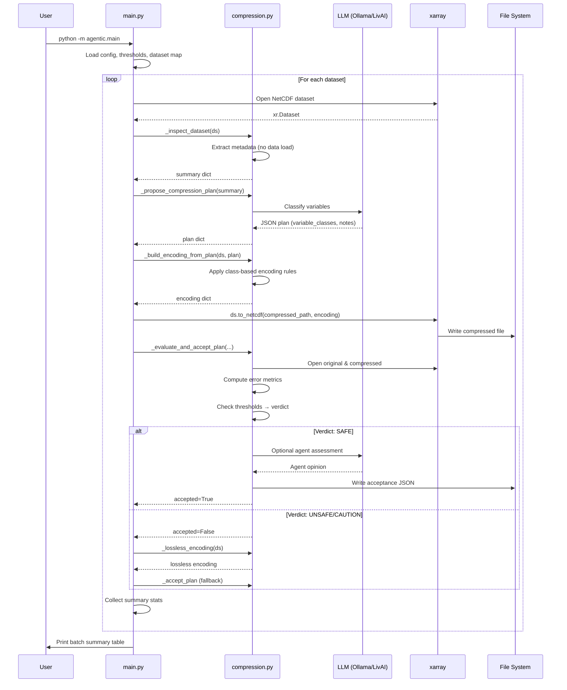

# Agentic Data Compression Workflow

This document describes the architecture and workflow for the agentic data compression system implemented in this repository.

## Workflow Diagram

```mermaid
flowchart TD
    Start([Start: main.py execution]) --> ConfigCheck{use_subset?}
    
    ConfigCheck -->|True| UseSubset[Use xcdat.tutorial datasets]
    ConfigCheck -->|False| ValidateFiles[Validate full dataset filepaths]
    
    UseSubset --> DatasetLoop[For each dataset in DATASET_MAP]
    ValidateFiles --> DatasetLoop
    
    DatasetLoop --> OpenDataset[Open NetCDF dataset with xarray]
    
    OpenDataset --> Inspect[Inspect Dataset: _inspect_dataset]
    
    %% Inspection phase
    Inspect --> ExtractMetadata[Extract metadata:<br/>- Dimensions & sizes<br/>- Variable dtypes & shapes<br/>- Coordinate info<br/>- Time frequency]
    
    ExtractMetadata --> ProposePlan[Propose Compression Plan:<br/>_propose_compression_plan]
    
    %% LLM interaction for planning
    ProposePlan --> LLMClassify[LLM: Classify variables into:<br/>- state (high precision)<br/>- diagnostic (medium precision)<br/>- index (low precision)]
    
    LLMClassify --> PlanJSON[Return JSON plan with<br/>variable_classes & notes]
    
    %% Candidate 1: Plan-based compression
    PlanJSON --> BuildEncoding[Build Encoding:<br/>_build_encoding_from_plan]
    
    BuildEncoding --> ApplyEncoding{Apply encoding rules:<br/>- state: zlib, complevel 4<br/>- diagnostic: downcast float64→float32<br/>- index: downcast to int16<br/>- bounds: always lossless}
    
    ApplyEncoding --> WriteCompressed[Write compressed NetCDF<br/>to output directory]
    
    WriteCompressed --> Evaluate[Evaluate Plan:<br/>_evaluate_and_accept_plan]
    
    %% Evaluation phase
    Evaluate --> ComputeMetrics[Compute error metrics:<br/>- RMSE relative<br/>- Max absolute relative<br/>- Mean absolute relative]
    
    ComputeMetrics --> CheckThresholds{Metrics within<br/>safety thresholds?}
    
    CheckThresholds -->|Yes| VerdictSafe[Verdict: SAFE]
    CheckThresholds -->|Near thresholds| VerdictCaution[Verdict: CAUTION]
    CheckThresholds -->|No| VerdictUnsafe[Verdict: UNSAFE]
    
    VerdictSafe --> AgentAssess[Optional: Agent assessment<br/>_agent_assess_plan]
    
    AgentAssess --> AcceptPlan[Accept Plan:<br/>_accept_plan]
    
    AcceptPlan --> RecordArtifact[Record to JSON artifact:<br/>- encoding<br/>- metrics<br/>- verdict<br/>- agent opinion]
    
    RecordArtifact --> SetCandidate[candidate_used =<br/>'plan-based compression']
    
    %% Fallback path
    VerdictCaution --> Fallback[Fallback to lossless<br/>compression]
    VerdictUnsafe --> Fallback
    
    Fallback --> LosslessEncoding[_lossless_encoding:<br/>zlib, complevel 4<br/>no dtype changes]
    
    LosslessEncoding --> AcceptFallback[Accept fallback plan]
    
    AcceptFallback --> SetFallbackCandidate[candidate_used =<br/>'lossless compression']
    
    %% Summary collection
    SetCandidate --> CollectSummary[Collect summary:<br/>- dataset name<br/>- variable<br/>- plan<br/>- candidate used<br/>- file sizes<br/>- encoding]
    
    SetFallbackCandidate --> CollectSummary
    
    CollectSummary --> MoreDatasets{More datasets<br/>to process?}
    
    MoreDatasets -->|Yes| DatasetLoop
    MoreDatasets -->|No| PrintSummary[Print Batch Summary:<br/>_print_batch_summary]
    
    PrintSummary --> End([End: Batch compression complete])
    
    %% Styling
    classDef llmNode fill:#e1f5ff,stroke:#0288d1,stroke-width:2px
    classDef decisionNode fill:#fff3e0,stroke:#f57c00,stroke-width:2px
    classDef dataNode fill:#f3e5f5,stroke:#7b1fa2,stroke-width:2px
    classDef processNode fill:#e8f5e9,stroke:#388e3c,stroke-width:2px
    
    class LLMClassify,AgentAssess llmNode
    class ConfigCheck,CheckThresholds,MoreDatasets decisionNode
    class OpenDataset,WriteCompressed,RecordArtifact dataNode
    class Inspect,ProposePlan,BuildEncoding,Evaluate,AcceptPlan processNode
```

## System Architecture

```mermaid
graph TB
    subgraph "Entry Point"
        Main[main.py]
    end
    
    subgraph "Configuration Layer"
        Config[config.py<br/>- Load .env<br/>- LLM backend config<br/>- Model selection]
        EnvFile[.env<br/>- LLM_BACKEND<br/>- LLM_MODEL<br/>- API keys]
    end
    
    subgraph "LLM Integration"
        LLM[llm.py<br/>- call_llm()<br/>- system_message()<br/>- OpenAI client wrapper]
        Backend{LLM Backend}
        Ollama[Ollama<br/>Local LLaMA 3.1]
        LivAI[LivAI<br/>Claude/GPT hosted]
    end
    
    subgraph "Workflow Modules"
        Compression[workflows/compression.py<br/>- _inspect_dataset<br/>- _propose_compression_plan<br/>- _build_encoding_from_plan<br/>- _evaluate_and_accept_plan<br/>- compare_compression_and_accuracy]
        Diagnostics[workflows/diagnostics.py<br/>Future: diagnostic analysis]
    end
    
    subgraph "Data Processing"
        XArray[xarray/xcdat<br/>NetCDF I/O]
        NumPy[numpy<br/>Numerical computation]
    end
    
    subgraph "Outputs"
        CompressedNC[Compressed NetCDF files<br/>data/output/compressed_*.nc]
        AcceptanceJSON[Acceptance summary JSON<br/>data/output/acceptance_summary_*.json]
        Console[Console output<br/>Batch summary tables]
    end
    
    Main --> Config
    Config --> EnvFile
    Config --> LLM
    
    LLM --> Backend
    Backend -->|LLM_BACKEND=ollama| Ollama
    Backend -->|LLM_BACKEND=livai| LivAI
    
    Main --> Compression
    Main -.-> Diagnostics
    
    Compression --> LLM
    Compression --> XArray
    Compression --> NumPy
    
    Compression --> CompressedNC
    Compression --> AcceptanceJSON
    Compression --> Console
    
    classDef entryNode fill:#ffebee,stroke:#c62828,stroke-width:3px
    classDef configNode fill:#e3f2fd,stroke:#1565c0,stroke-width:2px
    classDef llmNode fill:#e1f5ff,stroke:#0288d1,stroke-width:2px
    classDef workflowNode fill:#e8f5e9,stroke:#388e3c,stroke-width:2px
    classDef dataNode fill:#f3e5f5,stroke:#7b1fa2,stroke-width:2px
    classDef outputNode fill:#fff3e0,stroke:#f57c00,stroke-width:2px
    
    class Main entryNode
    class Config,EnvFile configNode
    class LLM,Backend,Ollama,LivAI llmNode
    class Compression,Diagnostics workflowNode
    class XArray,NumPy dataNode
    class CompressedNC,AcceptanceJSON,Console outputNode
```

## Key Components

### 1. Configuration (`config.py`)
- Loads environment variables from `.env`
- Configures LLM backend (Ollama or LivAI)
- Creates OpenAI-compatible client
- Sets model, temperature, and token limits

### 2. LLM Integration (`llm.py`)
- Provides unified interface to multiple LLM backends
- Defines scientific agent system prompt
- Wraps API calls with consistent error handling
- Supports both local (Ollama) and hosted (LivAI) models

### 3. Compression Workflow (`workflows/compression.py`)

#### Phase 1: Inspection
- **`_inspect_dataset()`**: Extract metadata without loading data
  - Dimensions, shapes, dtypes
  - Coordinate information
  - Time frequency inference

#### Phase 2: Planning
- **`_propose_compression_plan()`**: LLM-based variable classification
  - Classify variables as: state, diagnostic, or index
  - Return structured JSON plan with reasoning

#### Phase 3: Encoding
- **`_build_encoding_from_plan()`**: Generate xarray encoding dictionary
  - Apply class-based compression rules
  - Protect bounds and coordinate variables
  - Default: zlib level 4, safe dtype downcasting

#### Phase 4: Evaluation
- **`_evaluate_and_accept_plan()`**: Validate compression quality
  - Compute relative error metrics
  - Compare against safety thresholds
  - Generate deterministic verdicts (safe/caution/unsafe)

#### Phase 5: Decision
- **`_accept_plan()`**: Record accepted compression strategy
  - Persist to JSON artifact
  - Include metrics, encoding, and agent opinion

#### Fallback
- **`_lossless_encoding()`**: Safe default for failed candidates
  - Pure zlib compression
  - No dtype changes
  - Always safe

### 4. Main Entry Point (`main.py`)

The main script orchestrates the entire batch compression workflow:

1. **Setup**:
   - Define dataset map (variable names and file paths)
   - Set safety thresholds for error metrics
   - Create output directories

2. **Batch Processing Loop**:
   - Open each dataset (full or subset)
   - Inspect metadata
   - Request LLM compression plan
   - Apply plan-based compression
   - Evaluate against thresholds
   - Fallback to lossless if needed
   - Collect summary statistics

3. **Output**:
   - Print batch summary table
   - Write compressed NetCDF files
   - Generate acceptance summary JSON

## Data Flow



## Safety Thresholds

The workflow uses conservative relative error thresholds:

| Metric | Threshold | Description |
|--------|-----------|-------------|
| `rmse_rel` | 0.001 (0.1%) | Root Mean Squared Error / value range |
| `max_abs_rel` | 0.005 (0.5%) | Max absolute error / value range |
| `mean_abs_rel` | 0.0005 (0.05%) | Mean absolute error / value range |

Verdicts:
- **SAFE**: All metrics ≤ thresholds
- **CAUTION**: RMSE ≤ 2× threshold
- **UNSAFE**: RMSE > 2× threshold

## Variable Classification Strategy

The LLM classifies variables into three precision classes:

1. **State** (high precision):
   - Core prognostic variables (e.g., temperature, pressure)
   - Encoding: zlib level 4, preserve dtype
   - No lossy compression

2. **Diagnostic** (medium precision):
   - Derived variables (e.g., cloud fraction, fluxes)
   - Encoding: zlib level 4, downcast float64→float32

3. **Index** (low precision):
   - Coordinates, labels, bounds
   - Encoding: zlib level 4, downcast to int16 if applicable

## Running the Workflow

**With subset data (for testing):**
```bash
python -m agentic.main
```

**With full datasets:**
```bash
# Ensure filepaths in DATASET_MAP are valid
python -m agentic.main  # Edit main.py: main(use_subset=False)
```

## Outputs

1. **Compressed NetCDF files**: `data/output/compressed_plan_*.nc`
2. **Acceptance summary**: `data/output/acceptance_summary_<timestamp>.json`
3. **Console output**: Batch summary table with:
   - Dataset and variable names
   - Compression plan
   - Candidate used
   - Original and compressed sizes
   - Reduction percentage
   - Encoding details

## Future Enhancements

See the [project plan](https://github.com/aims-group/llnl-datathon-2026/pull/1#issuecomment-3801186301) for detailed next steps:

- Move beyond dummy data to real scientific datasets
- Automate error metric reporting (CSV/JSON export)
- Parameter exploration (sweep chunk sizes, compression levels)
- Domain-specific scientific evaluation
- Agentic iteration and feedback loops
- User interface (CLI, Jupyter notebooks, web UI)
- Scalability testing (Dask, parallel I/O)
